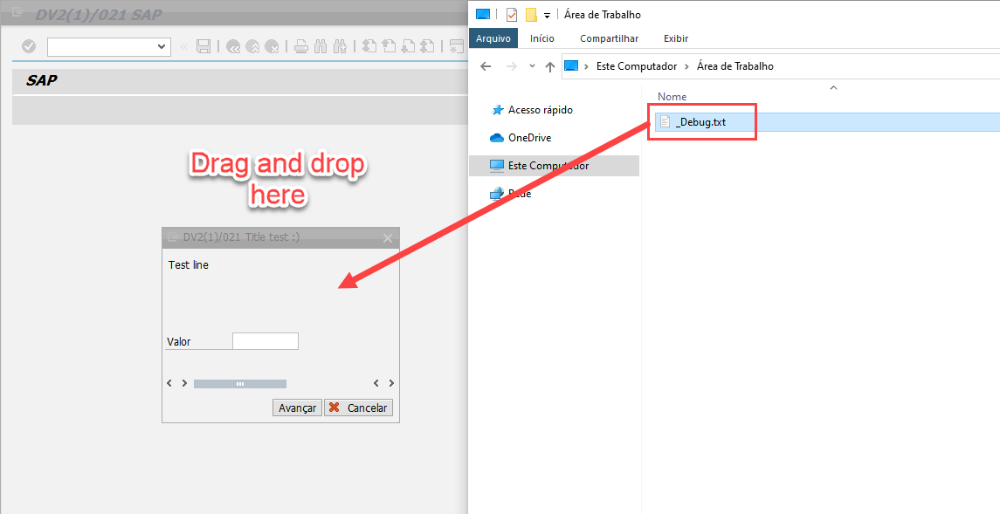

# Debugging ( /h ) from popup

So you can start debugging from a popup or some screen where you can't use /h, just drag [this file](./_Debug.txt) onto the SAP screen you're willing to debug.

When you see this message you're good to go. You just need to perform your action and the debug will show up.

